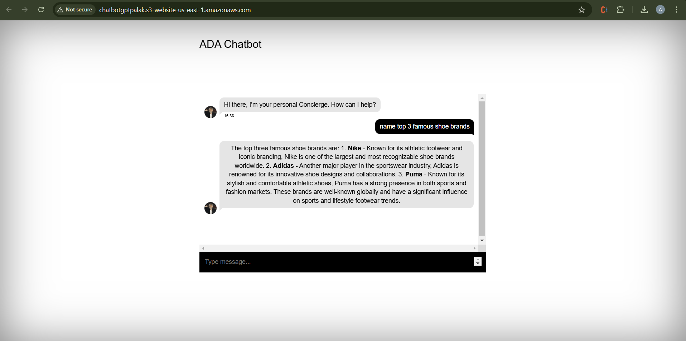
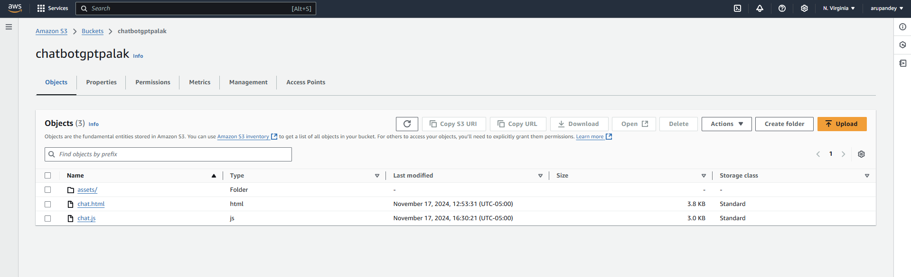
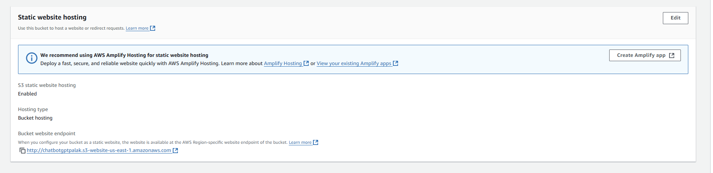
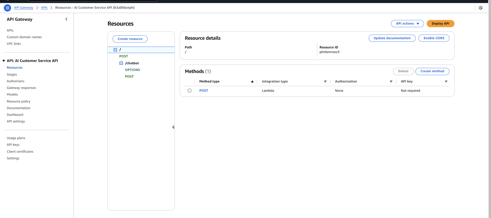
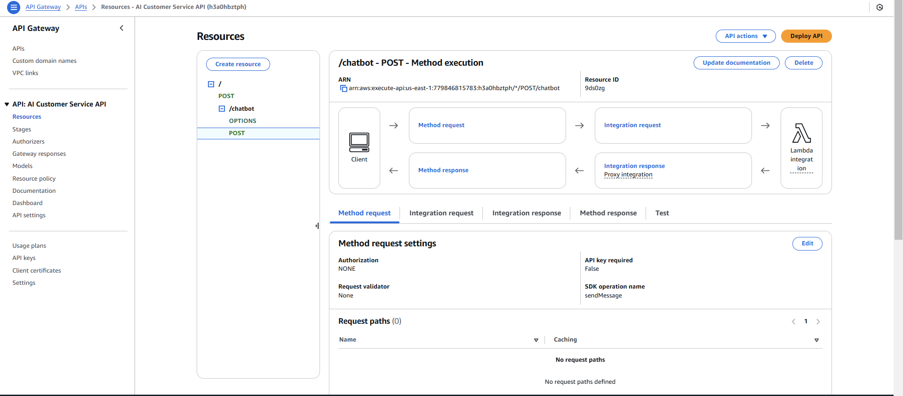
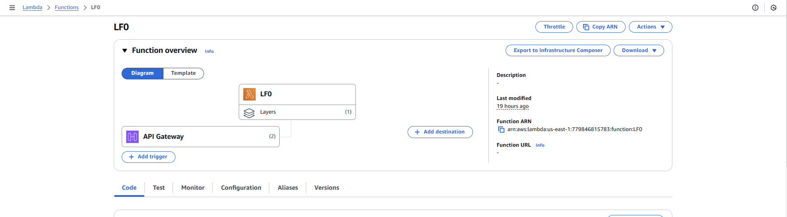
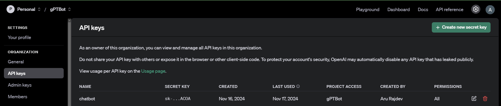

# Chatbot Web Application

This project is a fully functional chatbot web application that integrates a frontend interface hosted on AWS S3, with backend processing using AWS Lambda and the OpenAI GPT model. It uses AWS API Gateway to connect the frontend and backend, enabling smooth and secure interactions between users and GPT.

## Project Structure

### 1. Frontend Files
- **HTML File**: `chat.html`
  - **Purpose**: Sets up the structure and layout of the chatbot interface.
  - **Key Elements**:
    - Includes references to CSS and JavaScript files for styling and functionality.
    - Contains a message input box where users can type their messages and a "Send" button.
    - The chat area displays messages from both the user and GPT.
  - **Integration with Backend**: Uses JavaScript libraries to send user messages to the backend and display responses.

- **CSS Files**:
  - `chat.css`: Styles the chat interface, including message bubbles and animations.
  - `cover.css`: Provides general styling, like background colors and centering.
  - `main.css`: Custom styles for text and background colors.
  - `bootstrap.min.css`: Pre-defined Bootstrap styles for responsive design.
  - `ie10-viewport-bug-workaround.css`: Fixes known viewport issues in Internet Explorer 10.
  - **Purpose**: These files ensure a modern, responsive, and visually appealing interface.
  - **Integration with Backend**: These files only style the frontend and do not interact with the backend.

- **JavaScript File**: `chat.js`
  - **Purpose**: Handles user input, sends messages to the backend, and displays GPT responses.
  - **How It Works**:
    - Initializes the chat interface on page load.
    - Captures user messages, sends them to the backend via `callChatbotApi`, and clears the input box.
    - Uses `axios` to send HTTP requests to the backend and handle responses from GPT.
  - **Integration with Backend**: The backend URL and API key are used to communicate with the AWS Lambda function.

### 2. Backend Code
- **AWS Lambda Function**: `lambda_handler`
  - **Purpose**: Processes user messages and interacts with the OpenAI GPT model.
  - **How It Works**:
    - Extracts the user's message from the API Gateway event.
    - Sends the message to OpenAI’s API and retrieves GPT's response.
    - Formats and sends the response back to the frontend via API Gateway.
  - **Configuration**: 
    - Written in Python.
    - Uses environment variables to securely store the OpenAI API key.
    - Handles external API calls with the appropriate permissions.

## Integration Workflow


1. **User Interaction**:
   - A user types a message in the input box and clicks "Send".
2. **Frontend Handling**:
   - `chat.js` captures the message and sends an HTTP POST request to the backend.
   - Displays a loading animation while waiting for a response.
3. **Backend Processing**:
   - The Lambda function receives the request, forwards the message to OpenAI’s API, and retrieves a response.
   - Sends the formatted response back to the frontend.
4. **Displaying the Response**:
   - `chat.js` updates the chat interface with GPT's reply.
   - The chat area is updated to ensure smooth scrolling and interactivity.

## Project Components

### 1. Capturing and Sending User Input (Frontend - `chat.js`)
The `insertMessage` function captures the user input, sends it to the backend, and displays the response from GPT.

```javascript
function insertMessage() {
    let msg = $(".message-input").val();
    if ($.trim(msg) === "") {
        return false;
    }
    $('<div class="message message-personal">' + msg + "</div>")
        .appendTo($(".mCSB_container"))
        .addClass("new");
    $(".message-input").val(null);
    updateScrollbar();

    // Send the message to the backend
    callChatbotApi(msg)
        .then((response) => {
            console.log(response);
            insertResponseMessage(response.data);
        })
        .catch((error) => {
            console.log("An error occurred", error);
            insertResponseMessage("Oops, something went wrong. Please try again.");
        });
}
```
***Purpose:*** This function is responsible for sending the user's message to the backend and displaying the response in the chat.

### 2. Making the HTTP Request to the Backend (Frontend - `chat.js`)  
```
function callChatbotApi(message) {
    const headers = {
        "Content-Type": "application/json",
        Accept: "application/json",
        "x-api-key": "YOUR_API_KEY_HERE", // Replace with your actual API key if needed
        "Access-Control-Allow-Origin": "*",
    };

    // Construct the payload
    const jsonData = {
        message: message,
    };

    // Return the request promise
    return axios.post("YOUR_BACKEND_URL_HERE", jsonData, { headers });
}
```
***Purpose:*** This function handles sending the user's message to the backend (AWS Lambda) and returning the response.

### 3. Making the HTTP Request to the Backend (AWS Lambda Function - `lambda_handler`)  
```
import json
import os
import requests

def lambda_handler(event, context):
    # Log the incoming event for debugging
    print("Event:", json.dumps(event))

    try:
        # Parse the incoming event
        body = json.loads(event['body'])
        user_message = body.get('message')
        
        # Check if the message is provided
        if not user_message:
            return {
                'statusCode': 400,
                'body': json.dumps({'error': 'No message provided.'})
            }

        # Retrieve the API key securely from environment variables
        api_key = os.environ.get('OPENAI_API_KEY')
        headers = {
            'Content-Type': 'application/json',
            'Authorization': f'Bearer {api_key}',
        }

        # Construct the request payload
        json_data = {
            'model': 'gpt-4o-mini',
            'messages': [
                {'role': 'user', 'content': user_message},
            ],
        }

        # Make the request to OpenAI API
        response = requests.post('https://api.openai.com/v1/chat/completions', headers=headers, json=json_data)
        response.raise_for_status()  # Raise an error for bad status codes

        # Return the response content
        return {
            'statusCode': 200,
            'body': json.dumps({'message': response.json()["choices"][0]["message"]["content"]})
        }

    except Exception as e:
        print(f"Error: {e}")
        return {
            'statusCode': 500,
            'body': json.dumps({'error': 'Internal server error.'})
        }
```

***Purpose:*** This function processes the user’s message, communicates with GPT, and returns the generated response.

### 4. Displaying GPT’s Response (Frontend - `chat.js`) 
```
function insertResponseMessage(content) {
    $('<div class="message new"><figure class="avatar"></figure>' + content + "</div>")
        .appendTo($(".mCSB_container"))
        .addClass("new");
    updateScrollbar();
}
```
***Purpose:*** This function handles updating the chat interface with the GPT-generated message.


## Hosting the Frontend on S3


### Objective
Host the chatbot’s frontend as a static website on Amazon S3 for public access.

### Steps
1. Uploaded all frontend files (`chat.html`, CSS, and JavaScript) to an S3 bucket.
2. Configured the bucket for Static Website Hosting, specifying `chat.html` as the index document.
3. Modified the bucket policy to make it publicly accessible.
4. **Outcome**: The chatbot’s frontend is now accessible via a public URL, allowing users to interact with the application seamlessly.

## Setting Up API Gateway


### Objective
Create a secure API to connect the frontend with the backend Lambda function.

### Steps
1. Created a new API in Amazon API Gateway, selecting the HTTP API option.
2. Set up an endpoint (e.g., `/chat`) for the frontend to send messages.
3. Linked the API Gateway to the Lambda function, ensuring requests are routed correctly.
4. Configured CORS to allow secure communication between the frontend and backend.
5. **Outcome**: The API Gateway efficiently handles HTTP requests and connects the frontend and backend.

## Creating the Lambda Function

### Objective
Process user messages and interact with the OpenAI GPT model using AWS Lambda.

### Steps
1. Wrote the Lambda function in Python.
2. Configured the function to have the necessary permissions for external API calls.
3. Stored the OpenAI API key in environment variables for secure access.
4. **Role of the Lambda Function**:
   - Receives user messages from API Gateway.
   - Sends messages to OpenAI’s API and retrieves responses.
   - Sends formatted responses back to the frontend.
5. **Outcome**: The Lambda function serves as the core logic for the chatbot.

## Using OpenAI API Securely

### Objective
Ensure secure and authenticated requests to OpenAI’s API.

### Steps
1. Downloaded the OpenAI API key from the platform.
2. Stored the API key in AWS Lambda’s environment variables to avoid security risks.
3. Accessed the API key in the Lambda function using `os.environ.get('OPENAI_API_KEY')`.
4. **Outcome**: Securely authenticated requests to the GPT model, ensuring smooth communication between the frontend and GPT.

## How Everything Works Together
1. **User Interaction**: Users send messages via the chat interface.
2. **Frontend**: Sends messages to the backend and displays responses.
3. **Backend**: Processes messages, interacts with GPT, and returns responses.
4. **Display**: The frontend updates with GPT's replies, creating a seamless chat experience.

## Additional Information
- **Technologies Used**: HTML, CSS, JavaScript, AWS S3, API Gateway, Lambda, and OpenAI API.
- **Security Measures**: Used environment variables to secure API keys and configured CORS for safe cross-origin communication.
- **Hosting**: Frontend hosted on S3, with API requests managed by API Gateway and backend processing by AWS Lambda.

Enjoy using the chatbot!
